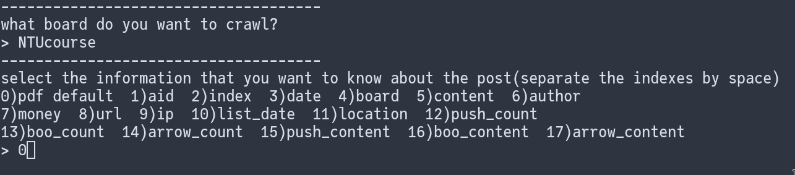

# usage

```{python}
python main.py
```
*note that the current working directory should be 'src'*

1. input your ptt id and password
2. select the board and what kinds of content you want to see(0 is the specific option according to my preference)

3. select the format


# dependencies
- PyPtt
- xlwings
- fpdf
- numpy

### use the following to install the dependencies
```sh
pip install PyPtt xlwings fpdf numpy
```

# reference
- https://github.com/PttCodingMan/PyPtt

